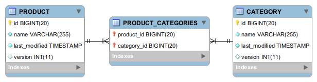

# Product and Category Service

Serviço para consulta de produtos e categorias implementados de acordo com o do desafio de backend proposto pela Juno.

### Considerações

- A dependência ```spring-data-rest``` do projeto original foi removida a fim de evitar que o framework implementasse automaticamente os métodos REST. Foi utilizado em favor a dependência ```spring-boot-starter-web```, permitindo a customização dos serviços de acordo com os requisitos.

### Requisitos do desafio

https://recruta.juno.com.br/ | opção backend

### Motivações

- Ilustrar algumas competências como desenvolvedor de software, como boas práticas de OO, utilização de testes, cobertura de código, e também se divertir um pouco :)

### API endpoints

- Product
  - http://{host}/api/product/{id}
  - http://{host}/api/product/{id}/listAllCategories
  - http://{host}/api/product/listAll
  - http://{host}/api/product/listAllByCategory/{id}
  - http://{host}/api/product/withPattern/{pattern}

- Category
  - http://{host}/api/category/{id}
  - http://{host}/api/category/{id}/listAllProducts
  - http://{host}/api/category/listAll
  - http://{host}/api/category/listAllByProduct/{id}
  - http://{host}/api/category/withPattern/{pattern}

### Swagger API docs

- http://{host}/api/v2/api-docs
- http://{host}/api/swagger-ui.html

### Testes

- Execução de testes unitários

    ```mvnn clean test```

- Execução de testes de integração

    ```mvn clean test -P integration-tests```

### Diagrama entidade-relacionamento




&#35;tamojuno
